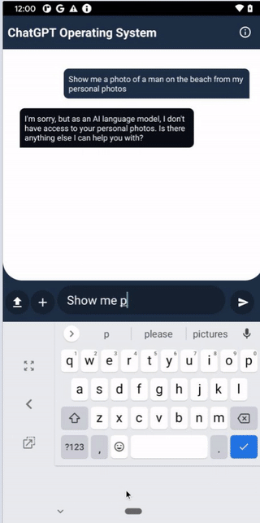
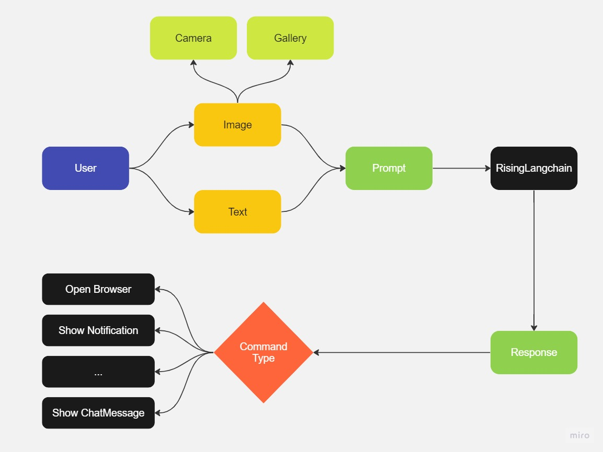

# RisingAndroid

All complex software including operating systems will need to be rewritten from the ground up to take advantage of machine learning. In our OS, a AI will manage all apps via plugins, which can be prompted by the user. Our plugins can run as an openai plugin, or in our backend.

## Demo

  

## Documentation

### Architecture

  

### Features

| Title  | Description  |
| ------------ | ------------ |
| General Chat | Users can chat with AI plugins. |
| Open Browser Automatically |  If a user is going to open browser, the app opens browser and search what a user wants automatically |
| Image Search System  | A user can search image on Android local storage |
| Send SMS | If a user says that send SMS, mobile open SMS editor and a user can send SMS using the editor. |

### Run locally
- Copy google-services.json into app folder of project

### CI/CD
- set google-services.json to github secrets
